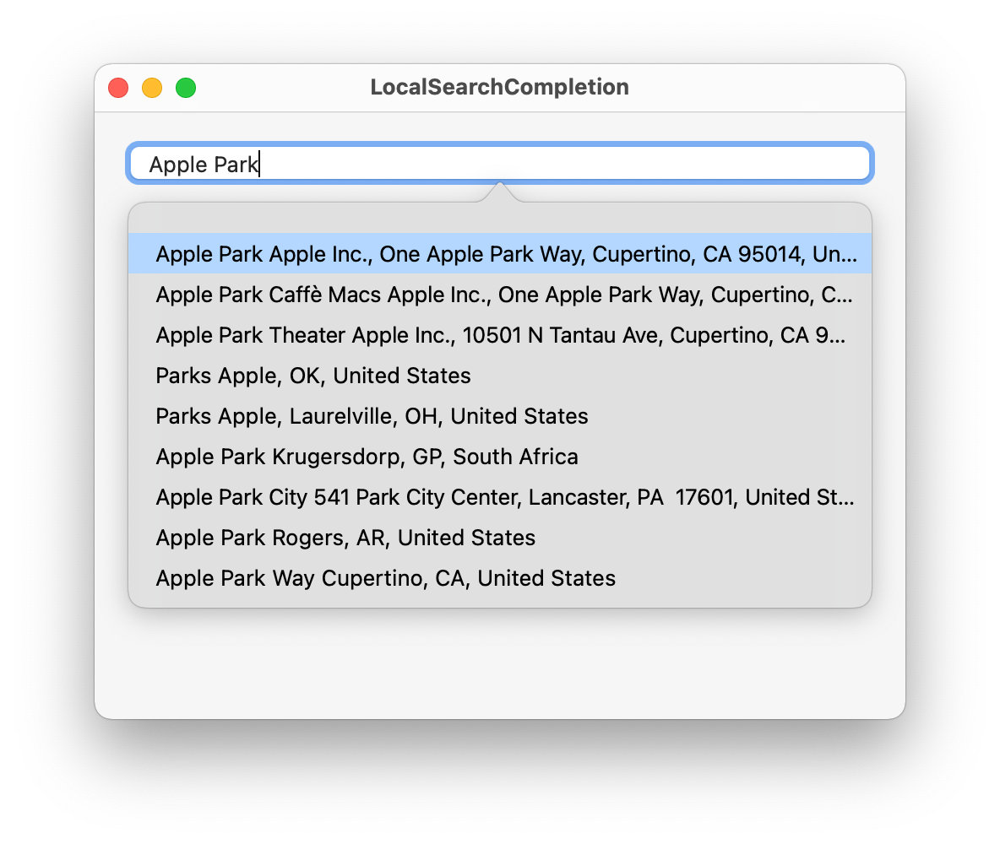

# Local Search Completion
----

Includes a AutocompleteTextField component (subclass of NSTextField) which will display a popover given a set of matching results. 

This demo uses an unbounded (not geo-restricted) instance of `MKLocalSearchCompleter` to fetch search results. 

#### Additions

- Keyboard navigation (up and down arrow keys) for traversing through search results, Escape key to dismiss search results and Enter key for selecting a search result. 